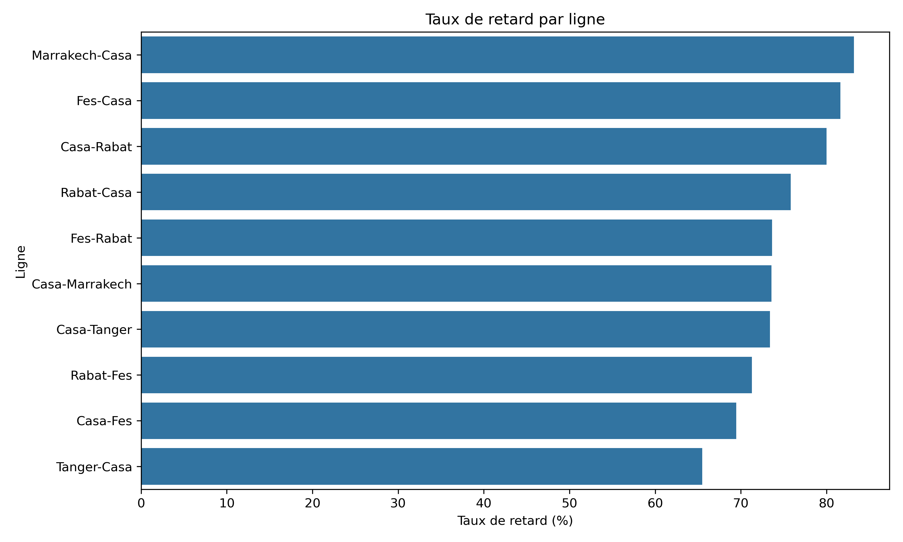
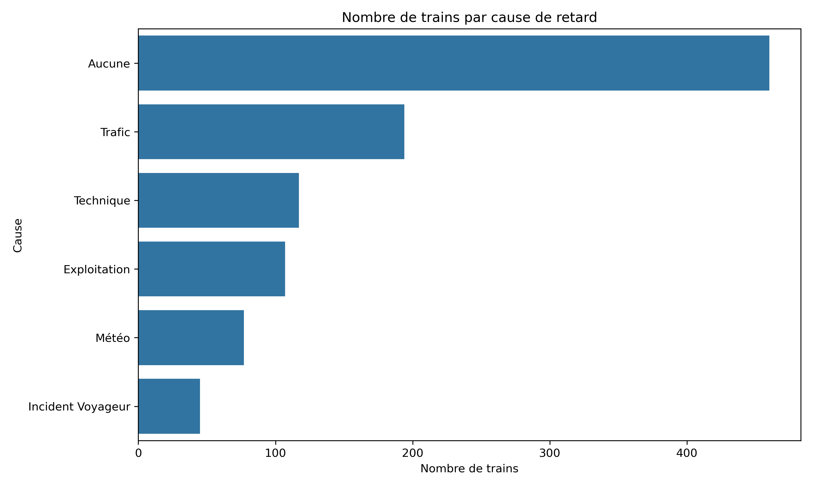
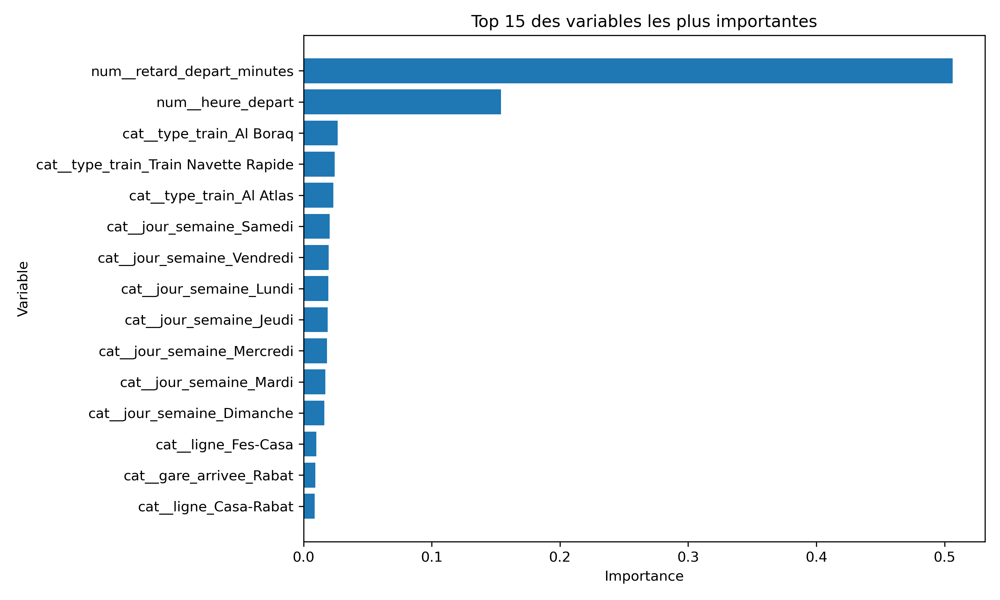
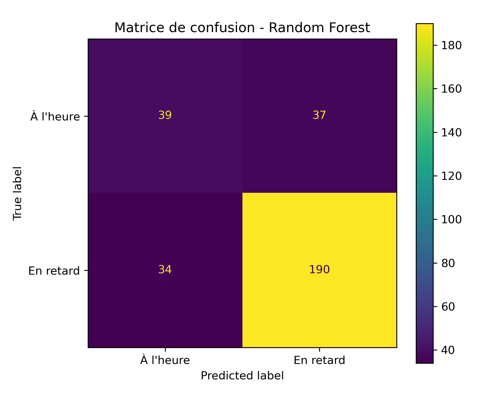
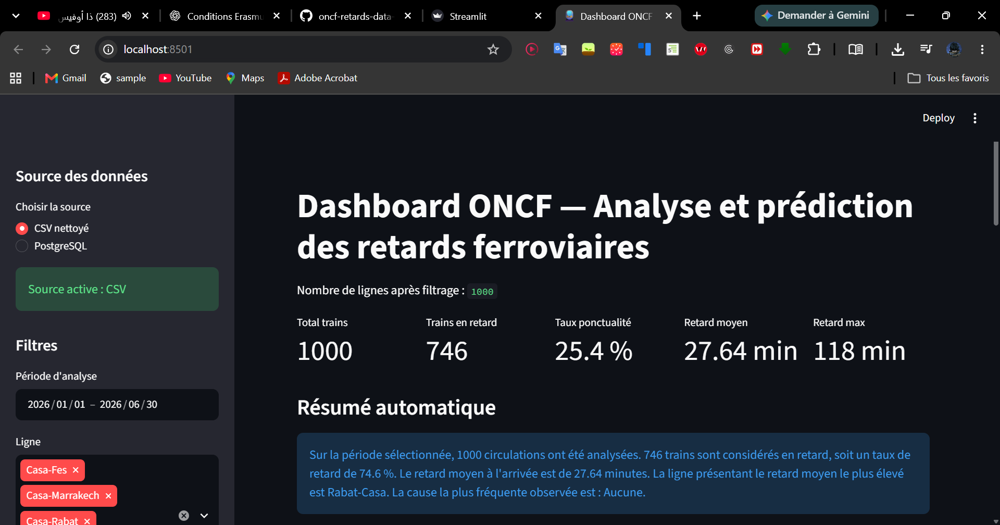
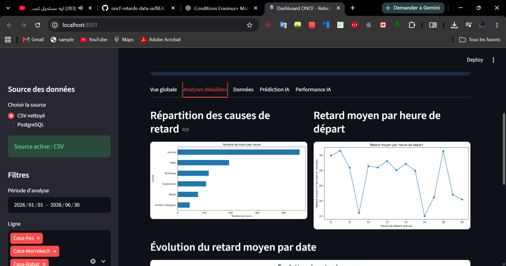
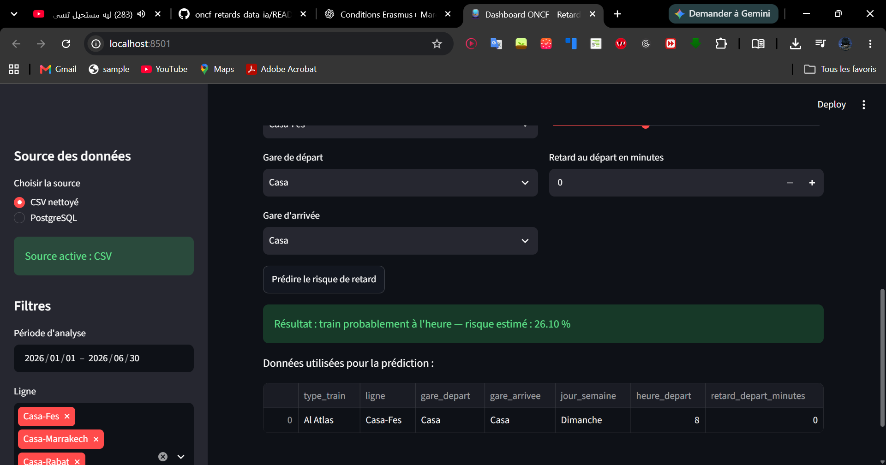

# Railway Delay Analysis and Prediction using Data Science and Machine Learning

## Overview

This project is a Data Science and Machine Learning prototype designed to analyze railway circulation data and predict train delay risk.

It demonstrates a complete Data/AI workflow: data generation, data cleaning, feature engineering, exploratory analysis, KPI reporting, database loading, model training, model evaluation, and dashboard visualization.

The project was developed as an academic portfolio project to show practical skills in data engineering, machine learning, and decision-support dashboards.

## Important Note About the Dataset

The dataset used in this project is simulated for academic and prototyping purposes.

The objective is not to claim operational accuracy on real ONCF data, but to demonstrate the design of a complete Data/AI pipeline that could later be connected to real railway operational data.

## Objectives

- Import and clean railway circulation data
- Calculate departure and arrival delays
- Analyze delays by line, station, cause, day, and hour
- Build punctuality and delay-related KPIs
- Store processed data in PostgreSQL
- Train and compare machine learning models
- Predict whether a train is likely to be delayed
- Visualize insights through an interactive Streamlit dashboard

## Data Pipeline

```text
Raw / simulated data
        |
        v
Data cleaning and preprocessing
        |
        v
Exploratory data analysis and KPI generation
        |
        v
Data visualization and reporting
        |
        v
PostgreSQL loading
        |
        v
Machine learning training and evaluation
        |
        v
Streamlit dashboard
```

## Technologies

- Python
- Pandas
- NumPy
- Matplotlib
- Seaborn
- Scikit-learn
- Streamlit
- PostgreSQL
- SQLAlchemy
- Joblib

## Machine Learning Approach

The goal of the machine learning component is to predict whether a train will be delayed or on time based on available operational features.

Target variable:

```text
train_en_retard
0 = on time
1 = delayed
```

Features used:

- Train type
- Railway line
- Departure station
- Arrival station
- Day of the week
- Departure hour
- Departure delay in minutes

## Model Comparison

| Model | Accuracy | Precision | Recall | F1-score |
|---|---:|---:|---:|---:|
| Random Forest | 76.33% | 83.70% | 84.82% | 84.26% |
| Decision Tree | 77.33% | 93.33% | 75.00% | 83.17% |
| Logistic Regression | 74.00% | 96.20% | 67.86% | 79.58% |

The selected model is **Random Forest**, because it provides the best balance between recall and F1-score for delay prediction.

## Visual Results

### Delay Rate by Railway Line



### Delay Causes



### Feature Importance



### Confusion Matrix



## Dashboard

The project includes a Streamlit dashboard for exploring railway delay indicators and interacting with the prediction model.

### Dashboard Overview



### KPI Analysis



### Delay Prediction




## Project Structure

```text
oncf-retards-data-ia/
|-- dashboard/
|   `-- app.py
|-- data/
|   |-- raw/
|   |   `-- circulations_oncf_sample.csv
|   `-- processed/
|       |-- analyse_par_cause.csv
|       |-- analyse_par_gare_depart.csv
|       |-- analyse_par_heure.csv
|       |-- analyse_par_jour.csv
|       |-- analyse_par_ligne.csv
|       `-- circulations_clean.csv
|-- docs/
|   |-- diagrammes/
|   `-- screenshots/
|-- models/
|   `-- model_retard_train.pkl
|-- reports/
|   |-- figures/
|   |-- feature_importance.csv
|   |-- kpi_report.txt
|   |-- ml_report.txt
|   `-- model_comparison.csv
|-- sql/
|   |-- create_tables.sql
|   `-- kpi_queries.sql
|-- src/
|   |-- 00_generate_sample_data.py
|   |-- 01_read_data.py
|   |-- 02_clean_data.py
|   |-- 03_analyze_data.py
|   |-- 04_visualize_data.py
|   |-- 05_load_to_postgres.py
|   |-- 06_train_model.py
|   `-- 07_run_pipeline.py
|-- main.py
|-- requirements.txt
|-- test_installation.py
`-- README.md

## How to Run

### 1. Clone the repository

```bash
git clone https://github.com/abdelmonimelqoraychy/oncf-retards-data-ia.git
cd oncf-retards-data-ia
```

### 2. Create and activate a virtual environment

```bash
python -m venv venv
source venv/bin/activate
```

On Windows:

```bash
venv\Scripts\activate
```

### 3. Install dependencies

```bash
pip install -r requirements.txt
```

### 4. Run the full pipeline

```bash
python src/07_run_pipeline.py
```

### 5. Launch the dashboard

```bash
streamlit run dashboard/app.py
```

## Reports

Generated reports are available in the `reports/` folder:

- `kpi_report.txt`: punctuality and delay indicators
- `ml_report.txt`: model comparison and evaluation
- `model_comparison.csv`: machine learning metrics
- `feature_importance.csv`: feature importance values

## Limitations

- The dataset is simulated and does not represent official ONCF operational data.
- The model performance depends on the quality and representativeness of the dataset.
- External factors such as weather, passenger flow, incidents, maintenance, and real-time traffic conditions are not included yet.
- The current version is an academic prototype, not a production railway system.

## Future Improvements

- Connect the pipeline to real railway operational data
- Add weather, incident, and infrastructure variables
- Improve feature engineering
- Add real-time prediction capabilities
- Deploy the Streamlit dashboard online
- Add model monitoring and automated retraining

## Author

**ABDELMONIM EL-QORAYCHY**

Computer Engineering graduate interested in Data Science, Artificial Intelligence, and intelligent transportation systems.
