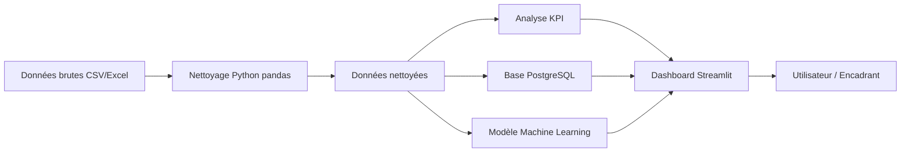
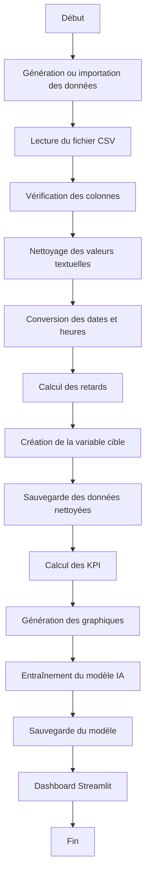
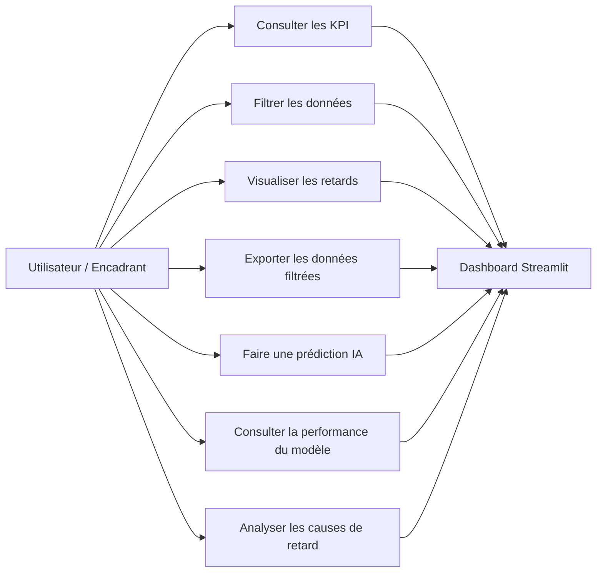
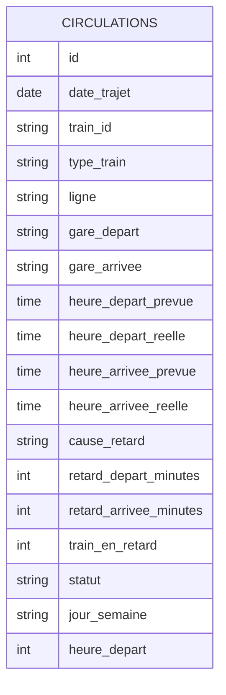

# Diagrammes du projet ONCF — Analyse et prédiction des retards ferroviaires

## 1. Diagramme d’architecture générale



## Description

Ce diagramme représente l’architecture globale de la plateforme. Les données brutes sont importées, nettoyées avec Python et pandas, puis utilisées pour l’analyse statistique, le stockage dans PostgreSQL, l’entraînement du modèle Machine Learning et l’alimentation du dashboard Streamlit.

---

## 2. Diagramme du pipeline Data



## Description

Ce pipeline décrit les différentes étapes de traitement des données. Il commence par l’importation ou la génération des données, puis passe par le nettoyage, le calcul des retards, la création des indicateurs, la génération des visualisations et l’entraînement du modèle prédictif.

---

## 3. Diagramme de cas d’utilisation



## Description

Ce diagramme présente les principales fonctionnalités offertes à l’utilisateur. Le dashboard permet de consulter les indicateurs, appliquer des filtres, analyser les retards, exporter les données et utiliser le modèle de prédiction IA.

---

## 4. Diagramme du modèle de données simplifié



## Description

Ce modèle de données simplifié représente la table principale utilisée dans le projet. La table `circulations` contient les informations relatives aux trajets ferroviaires, aux horaires prévus et réels, aux retards calculés, au statut du train et aux variables utilisées pour l’analyse et le Machine Learning.

---

# Utilisation dans le rapport

Ces diagrammes peuvent être intégrés dans le chapitre :

```text
Chapitre 2 — Analyse et conception
```

ou dans :

```text
Chapitre 3 — Réalisation technique
```